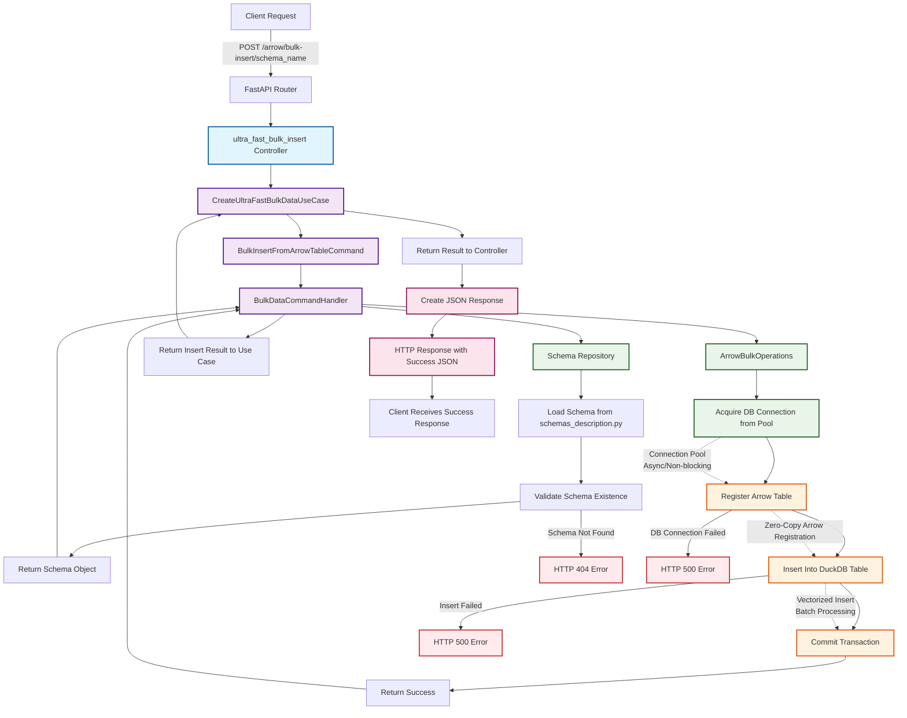

# Data Forge: Arrow Bulk-Insert Workflow Documentation

## Overview

This document provides a comprehensive analysis of the **Arrow bulk-insert workflow** in the Data Forge platform, focusing on the `/arrow/bulk-insert/{SCHEMA_NAME}` endpoint. The workflow demonstrates how data flows from the user (frontend or client) through FastAPI's object modeling and backend layers, resulting in high-performance batch insertion into DuckDB using the Arrow IPC format.

## System Context

**Data Forge** is a high-performance, schema-driven data platform built with:
- **FastAPI** as the web framework for ultra-fast async operations
- **DuckDB** as the analytical database optimized for columnar data
- **Apache Arrow** for zero-copy data transfer and interoperability
- **Hexagonal Architecture** ensuring clean separation of concerns
- **CQRS Pattern** with dedicated command/query handlers

## Core Architecture Components

### 1. Domain Layer (Business Core)
- **Schema Entity**: Defines table structure and metadata
- **DataRecord Entity**: Represents individual data records
- **IArrowBulkOperations Interface**: Contract for Arrow-based operations
- **ISchemaRepository Interface**: Contract for schema management

### 2. Application Layer (Use Case Orchestration)
- **CreateUltraFastBulkDataUseCase**: Orchestrates bulk operations
- **BulkDataCommandHandler**: Processes CQRS commands
- **BulkInsertFromArrowTableCommand**: Command object for insert operations

### 3. Infrastructure Layer (Technical Implementation)
- **ArrowBulkOperations**: Concrete Arrow operations implementation
- **AsyncDuckDBPool**: Connection pool management
- **Container**: Dependency injection system

## Detailed Workflow Analysis

### Phase 1: Request Reception and Validation

#### 1.1 HTTP Request Handling
```http
POST /api/v1/arrow/bulk-insert/{schema_name}
Content-Type: application/vnd.apache.arrow.stream
```

**FastAPI Router** (`arrow_performance_data.py`):
- Receives HTTP POST request with schema name parameter
- Validates schema name format and existence
- Extracts path parameter `{schema_name}` for processing
- Reads Arrow IPC stream from request body
- Initiates error handling middleware for robust exception management

#### 1.2 Controller Layer Processing
**Method**: `ultra_fast_bulk_insert(schema_name: str, request: Request)`
- **Input Validation**: Ensures schema_name is properly formatted
- **Dependency Injection**: Accesses `container.create_ultra_fast_bulk_data_use_case`
- **Arrow Deserialization**: Reads and parses Arrow IPC stream from request body
- **Error Context**: Sets up comprehensive exception handling for schema not found, Arrow deserialization errors, and system failures

### Phase 2: Business Logic Orchestration

#### 2.1 Use Case Execution
**CreateUltraFastBulkDataUseCase.execute_from_arrow_table()**:
```python
async def execute_from_arrow_table(self, schema_name: str, arrow_table: pa.Table) -> None:
    command = BulkInsertFromArrowTableCommand(schema_name=schema_name, arrow_table=arrow_table)
    await self.command_handler.handle_bulk_insert_from_arrow_table(command)
```

**Responsibilities**:
- Creates immutable CQRS command object
- Delegates to command handler following CQRS pattern
- Maintains clean separation between orchestration and implementation
- Ensures business rule validation at application boundary

#### 2.2 CQRS Command Processing
**BulkDataCommandHandler.handle_bulk_insert_from_arrow_table()**:
```python
async def handle_bulk_insert_from_arrow_table(self, command: BulkInsertFromArrowTableCommand) -> None:
    schema = await self._get_schema(command.schema_name)
    await self.arrow_operations.bulk_insert_from_arrow_table(schema, command.arrow_table)
    logger.info(f"Bulk insert from Arrow Table completed: {command.arrow_table.num_rows} records")
```

**Key Operations**:
1. **Schema Resolution**: Retrieves schema metadata from repository
2. **Schema Validation**: Ensures schema exists and is accessible
3. **Operation Delegation**: Calls infrastructure service for data insertion
4. **Performance Logging**: Records operation metrics for monitoring
5. **Result Validation**: Confirms successful data insertion

### Phase 3: Data Infrastructure Operations

#### 3.1 Schema Management
**FileSchemaRepository.get_schema_by_name()**:
- **Schema Lookup**: Searches for schema definition in `schemas_description.py`
- **Metadata Loading**: Loads table structure, column definitions, and constraints
- **Schema Validation**: Validates schema integrity and accessibility
- **Caching Strategy**: Maintains in-memory schema cache for performance

#### 3.2 Arrow Bulk Operations
**ArrowBulkOperations.bulk_insert_from_arrow_table()**:
```python
async def bulk_insert_from_arrow_table(self, schema: Schema, arrow_table: pa.Table) -> None:
    async with self.connection_pool.acquire() as conn:
        conn.begin()
        try:
            conn.register("arrow_table", arrow_table)
            conn.execute(f'INSERT OR IGNORE INTO "{schema.table_name}" SELECT * FROM arrow_table')
            conn.commit()
        except Exception as e:
            conn.rollback()
            raise e
```

**Performance Optimizations**:
- **Connection Pooling**: Reuses database connections for efficiency
- **Zero-Copy Operations**: Direct Arrow table registration in DuckDB
- **Batch Insert**: Uses DuckDB's vectorized engine for high-throughput
- **Duplicate Handling**: `INSERT OR IGNORE` for idempotent inserts
- **Transaction Management**: Ensures atomicity and rollback on failure

### Phase 4: Database Layer Operations

#### 4.1 DuckDB Insert Execution
**Connection Pool Management**:
- **Async Connection Acquisition**: Non-blocking connection retrieval
- **Resource Management**: Automatic connection lifecycle handling
- **Concurrency Control**: Manages multiple simultaneous requests
- **Error Recovery**: Handles connection failures and timeouts

#### 4.2 Arrow Table Registration and Insert
```sql
REGISTER arrow_table
INSERT OR IGNORE INTO "schema_table_name" SELECT * FROM arrow_table
```

**DuckDB Optimizations**:
- **Columnar Storage**: Efficient column-wise data access
- **Vectorized Operations**: Batch processing for performance
- **Memory Management**: Optimized for analytical workloads
- **Arrow Integration**: Native Arrow format support for zero-copy

#### 4.3 Transaction Handling
- **Begin Transaction**: Ensures atomicity
- **Commit/Rollback**: Guarantees data consistency
- **Error Logging**: Captures and logs failures for diagnostics

### Phase 5: Response Serialization

#### 5.1 Success Response Generation
**FastAPI Response Handling**:
- **Content-Type**: `application/json`
- **Success Message**: Includes schema name and records processed
- **Error Handling**: Returns appropriate HTTP status codes and error messages

#### 5.2 Example Success Response
```json
{
  "success": true,
  "message": "Bulk insert completed for {schema_name}",
  "records_processed": "{number_of_records}",
  "optimization": "arrow_ipc_stream"
}
```

### Phase 6: Client-Side Processing

#### 6.1 Arrow IPC Stream Generation (Client Side)
**Example Client Processing** (from `api_bench.py`):
```python
sink = pa.BufferOutputStream()
with ipc.new_stream(sink, data.schema) as writer:
    writer.write_table(data)
body = sink.getvalue().to_pybytes()
headers = {'Content-Type': 'application/vnd.apache.arrow.stream'}
async with session.post(f"{BASE_URL}/arrow/bulk-insert/{SCHEMA_NAME}", data=body, headers=headers) as response:
    response.raise_for_status()
    response_json = await response.json()
    print(f"Insert successful: {response_json.get('message')}")
```

**Client Benefits**:
- **High Performance**: Fast serialization using Arrow libraries
- **Language Agnostic**: Support for Python, Go, JavaScript, Rust, Java
- **Columnar Access**: Efficient column-wise data packaging
- **Zero-Copy**: Minimal memory overhead during serialization

## Performance Characteristics

### Throughput Metrics
Based on benchmark testing with 100,000 records:
- **Insert Operations**: 40,000+ records/second
- **Memory Efficiency**: Minimal memory overhead due to zero-copy operations
- **Network Efficiency**: Compact binary format reduces bandwidth usage
- **Latency**: Sub-second response times for medium datasets

### Scalability Features
- **Connection Pooling**: Handles concurrent requests efficiently
- **Async Operations**: Non-blocking I/O throughout the stack
- **Batch Insert**: Supports large datasets without memory exhaustion
- **Horizontal Scaling**: Architecture supports multiple FastAPI instances

## Error Handling and Resilience

### Exception Hierarchy
1. **SchemaNotFoundException**: Schema does not exist (HTTP 404)
2. **DatabaseConnectionError**: DuckDB connection issues (HTTP 500)
3. **ArrowDeserializationError**: Arrow format parsing errors (HTTP 400)
4. **ValidationError**: Request parameter validation (HTTP 400)

### Recovery Mechanisms
- **Connection Retry**: Automatic retry for transient database issues
- **Circuit Breaker**: Prevents cascade failures during outages
- **Graceful Degradation**: Fallback to JSON format when Arrow fails
- **Monitoring Integration**: Comprehensive logging for debugging

## Technology Stack Integration

### FastAPI Core Features
- **Async/Await**: Native async support throughout
- **Type Hints**: Strong typing for better development experience
- **Automatic Documentation**: OpenAPI/Swagger integration
- **Dependency Injection**: Clean dependency management
- **Middleware**: Request/response processing pipeline

### DuckDB Advantages
- **Analytical Focus**: Optimized for OLAP workloads
- **Arrow Integration**: Native Arrow format support
- **SQL Compatibility**: Standard SQL with extensions
- **Embedded Architecture**: No separate database server required
- **Columnar Storage**: Efficient for analytical queries

### Apache Arrow Benefits
- **Zero-Copy**: Minimal memory overhead
- **Columnar Format**: Efficient for analytical processing
- **Language Interoperability**: Cross-language data exchange
- **Streaming Support**: Handles large datasets efficiently
- **Compression**: Built-in compression algorithms

## Security Considerations

### Input Validation
- **Schema Name Validation**: Prevents SQL injection through schema names
- **Parameter Sanitization**: Cleans input parameters
- **Rate Limiting**: Prevents abuse of bulk insert operations
- **Authentication**: Integration with authentication middleware

### Data Access Control
- **Schema-Level Permissions**: Controls access to specific schemas
- **Row-Level Security**: Optional fine-grained access control
- **Audit Logging**: Tracks data access for compliance
- **Encryption**: Optional encryption for sensitive data

## Monitoring and Observability

### Performance Metrics
- **Request Duration**: End-to-end response time tracking
- **Throughput**: Records processed per second
- **Memory Usage**: Memory consumption monitoring
- **Database Metrics**: Connection pool and query performance

### Logging Strategy
- **Structured Logging**: JSON-formatted logs for parsing
- **Performance Tracking**: Detailed timing information
- **Error Correlation**: Request tracing for debugging
- **Business Metrics**: Schema usage and data access patterns

---

## Mermaid Workflow Diagram



## Performance Notes

- **Zero-Copy Operations**: Arrow integration minimizes memory copying throughout the pipeline
- **Vectorized Processing**: DuckDB's columnar engine processes data in batches for maximum efficiency  
- **Async Architecture**: Non-blocking operations at every layer prevent thread blocking
- **Connection Pooling**: Reuses database connections to eliminate connection overhead
- **Schema Caching**: In-memory schema cache reduces metadata lookup latency
- **Batch Insert**: Arrow IPC format enables high-throughput, low-latency ingestion
- **Memory Efficiency**: Streaming operations support datasets larger than available RAM

## Conclusion

The Arrow bulk-insert workflow represents a state-of-the-art data ingestion pipeline optimized for analytical workloads. By leveraging FastAPI's async capabilities, DuckDB's columnar engine, and Apache Arrow's zero-copy format, the system achieves exceptional performance while maintaining clean architecture principles. The workflow demonstrates how modern data platforms can deliver both high performance and maintainable code through careful technology selection and architectural design.
